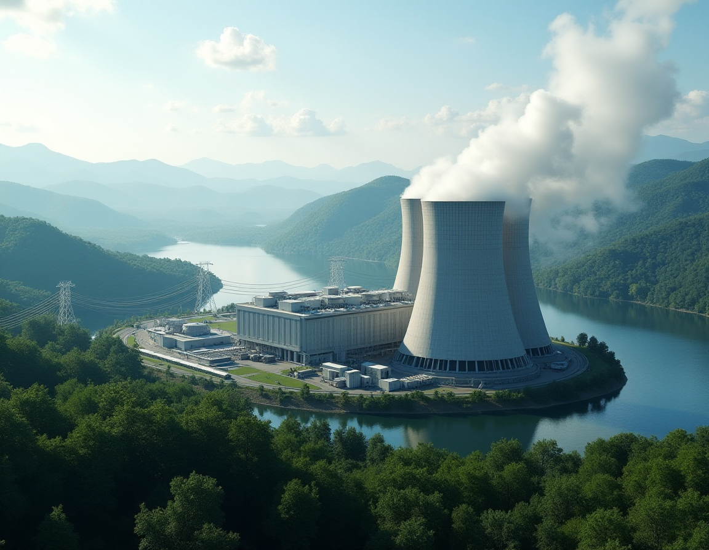

# Maestría en Inteligencia Artificial

# Análisis de Series de Tiempo

# Trabajo Final

## Integrantes:
   - Trinidad Monreal
   - Jorge Ceferino Valdez
   - Jorge Blajevitch

### Dataset empleado "Nuclear Capacity":
 * El archivo "Nuclear Capacity.csv" se encuentra difundido en [Kaggle](https://www.kaggle.com/datasets/gagado/nuclear-capacity/data). 
 * Contiene datos diarios sobre la capacidad nuclear instalada en EE. UU., expresados en Megavatios. 
 * Aunque no se especifica explícitamente en la descripción de Kaggle, se infiere que los datos se derivan de fuentes oficiales, muy probablemente de la EIA o, en menor medida, de la NRC.